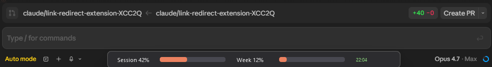

# Claude Usage Bar

Version 0.3.0

A thin always-on-top Windows widget that shows your Claude.ai Pro and Max usage as two progress bars pinned to the bottom of your screen. Tracks the five-hour session cap and the weekly all-models cap. Polls every two minutes.

## Install

Download `ClaudeUsageBarSetup.exe` from Releases and run it. Installs to Program Files, creates Start Menu and desktop shortcuts, and offers a Windows startup option.

**From source:** requires Python 3.10+ on Windows. Clone the repo, double-click `run.bat`. First run creates a `.venv` and installs dependencies automatically.

## Usage

On first launch the bar shows an error until a session cookie is configured. Open Setup from the right-click menu.

1. Open claude.ai in your browser and sign in
2. Open DevTools (F12), go to the Network tab, reload the page
3. Click any request to claude.ai, open its Headers panel, copy the full `cookie:` value from Request Headers
4. Right-click the bar, choose Setup, paste the value into the Cookie field, click Test, then Save

**Controls:**

- Click and hold Session or Week to see the reset time in place
- Click the time display on the right to open the full usage breakdown
- Drag anywhere on the bar to reposition it
- Right-click for Refresh, Setup, Reset position, and Quit

**Advanced options** (Setup, expand at bottom): set cookie source browser, enable manual value entry, or enable "Show only when Claude Desktop is running."

## How it works

Calls `claude.ai/api/organizations/{id}/usage` with your session cookie. Falls back to scraping `claude.ai/settings/usage` if the API path fails. Uses `curl_cffi` with Chrome TLS impersonation to pass Cloudflare bot detection. Cookies are read from your local browser profile via `browser_cookie3` if no cookie is pasted manually.

## Known limitations

- Chrome v127+ encrypts cookies at the application level; automatic extraction fails. Paste manually from DevTools. Edge and Firefox are not affected.
- The usage API is undocumented and may change without notice.
- Pins to the primary display. Drag to reposition; use Reset position to return to bottom-center.

## Privacy

Your session cookie is stored in `%APPDATA%\ClaudeUsageBar\config.json`. It is sent only to `claude.ai` to fetch usage data. Nothing is sent to any third party.

## Colophon

Published by AppCaddy. Author, Andrew Ryan.
